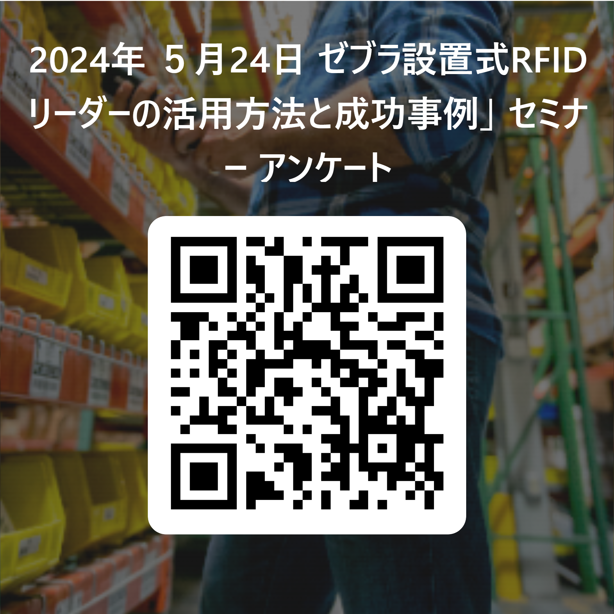

# 本日はゼブラ・テクノロジーズ・ジャパンのセミナーにご参加いただきありがとうございます。
 

## ■ セミナー

### ゼブラ設置式RFIDリーダーの有効活用方法

1. ゼブラのFXリーダとは︖
2. デモを通して、読み取りパフォーマンスを体験
   - 123RFID Desktop
   - ブラウザアプリ
   - 温度センサーRFタグ
   - エンベデッドアプリ
3. エンド様に選ばれるポイントをわかりやすく説明
4. FAQを通して、RFIDお困りごとのディスカッション
 

## ■ 館内ルール

1. 14F オフィスゾーンへの立ち入りは禁止です。
1. トイレ、自動販売機、喫煙コーナーは1Fをご利用願います。
 

## ■ Wi-Fi 接続について

|||
|-|-|
| SSID |   Zatar
| Pass |   xxxxxxxxxxxxxxxx (白板を確認)
|||

 

## ■ Linux Server 接続について

|||
|-|-|
|server |   blacklily 192.168.4.133
|ID      | zebra
|Pass |   xxxxxxxxxxxxxxxx (白板を確認)
|||

## ■ アンケートへのご協力お願いいたします。

https://forms.office.com/r/M57HqQ26Pt

